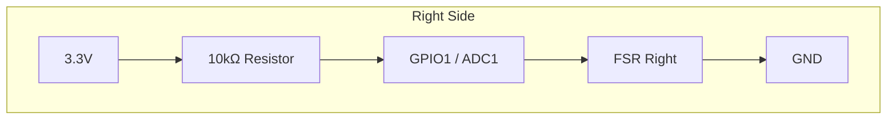
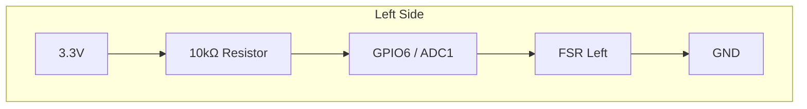

# 🛏️ Smart Bed Sensor with FSR and ESPHome

[](https://esphome.io/)
[](https://www.espressif.com/en/products/socs/esp32-c6)
[](https://www.home-assistant.io/)

A dual-zone bed occupancy sensor based on Force Sensitive Resistors (FSR) and ESP32-C6. Fast detection, false-trigger protection, and seamless Home Assistant integration via ESPHome.

[🇷🇺 Русская версия](README_ru.md)

## ✨ Features

- 🎯 **Two independent channels** – left and right side of the bed.
- ⚡ **Instant response** – hardware oversampling, median filter, and configurable turn-on delay (from 0.1 s).
- 📊 **Smooth graphs in HA** – separate filtered voltage sensor without sacrificing trigger speed.
- 🎚️ **Separate on/off thresholds** – hysteresis eliminates bouncing.
- ⏱️ **Adjustable delays** – confirmation time for presence and absence.
- 🌐 **Thread support** – ESP32-C6 as Full Thread Device.
- 🔧 **Easy calibration** – all parameters adjustable directly from Home Assistant UI.

## 📦 Hardware

| Component | Purpose |
|-----------|---------|
| ESP32-C6-DevKitC-1 | Microcontroller with Wi-Fi 6, BLE 5.3, and Thread |
| 2 × FSR strip | Pressure sensors (e.g., RP-C18.3-LT) |
| 2 × 10 kΩ resistor | For voltage divider |

## 🔌 Wiring Diagram

Each FSR is connected as the lower leg of a voltage divider:




| Sensor | ESP32-C6 GPIO |
|--------|---------------|
| Right  | GPIO1         |
| Left   | GPIO6         |

> ⚠️ Internal pull‑ups/downs are not used – the divider sets the idle voltage.

## 🧠 How It Works

### Fast channel for occupancy detection

```yaml
adc:
  update_interval: 100ms
  samples: 4
  filters:
    - median (window 3)
    - throttle 200ms
```
- Raw values are hidden from HA (internal: true).
- Binary sensor uses this fast data to react in fractions of a second.

### Hysteresis & Delays

 - ON threshold – voltage above which the bed is considered occupied.
 - OFF threshold – voltage below which the bed is considered empty.
 - Turn-on delay – how many seconds the value must stay above threshold before switching to on (typical 0.2–0.5 s).
 - Turn-off delay – how many minutes the value must stay below threshold before switching to off (e.g., 5 min).

### ⚙️ Configuration in Home Assistant

All settings are exposed as number entities:

number.right_on_threshold
number.right_off_threshold
number.left_on_threshold
number.left_off_threshold
number.turn_on_delay (seconds)
number.turn_off_delay (minutes)
Tuning thresholds:

Open the graph for sensor.right_voltage in HA.
Observe the voltage with an empty bed and with a person lying down.
Set the ON threshold slightly below the “occupied” value, and OFF threshold slightly above the “empty” value.

### 📋 Example Automation

Motion lights in bedroom only when the bed is empty:
```yaml
alias: "Motion light – only if bed empty"
trigger:
  - platform: state
    entity_id: binary_sensor.bedroom_motion
    to: "on"
condition:
  - condition: state
    entity_id: binary_sensor.bed_right
    state: "off"
action:
  - service: light.turn_on
    target:
      entity_id: light.bedroom
```
### 📸 Screenshots


📄 License

MIT © 2026 [F-Lab]

Made with ❤️ by f1x6r
