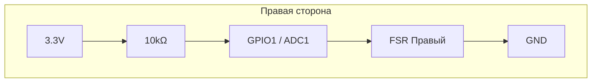
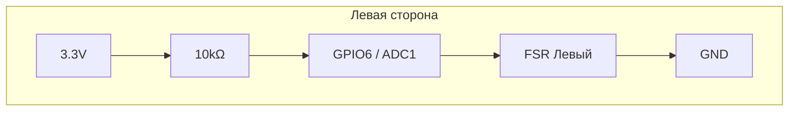
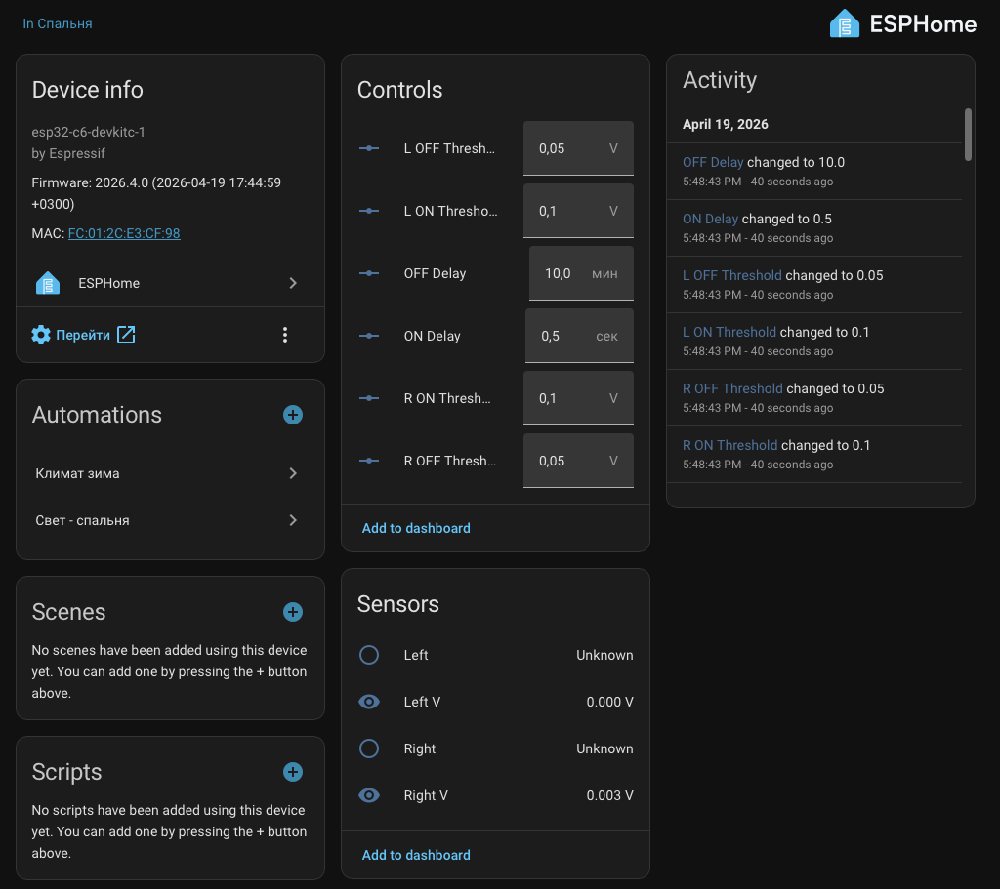
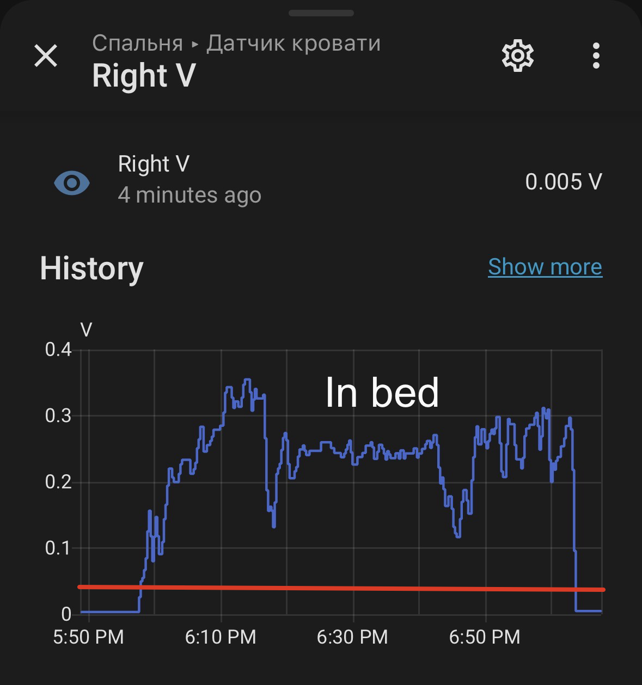

# 🛏️ Умный датчик кровати на FSR и ESPHome

[](https://esphome.io/)
[](https://www.espressif.com/en/products/socs/esp32-c6)
[](https://www.home-assistant.io/)

Двухзонный датчик присутствия в кровати на основе ленточных датчиков давления (FSR) и ESP32-C6. Быстрое обнаружение, защита от ложных срабатываний и полная интеграция с Home Assistant через ESPHome.

[🇬🇧 English version](README.md)

## ✨ Особенности

- 🎯 **Два независимых канала** – для левой и правой стороны кровати.
- ⚡ **Мгновенная реакция** – аппаратное усреднение, медианный фильтр и минимальная задержка включения (от 0.1 с).
- 📊 **Плавные графики в HA** – отдельный сглаженный сенсор напряжения без потери скорости срабатывания.
- 🎚️ **Раздельные пороги включения и выключения** – гистерезис исключает дребезг.
- ⏱️ **Настраиваемые задержки** – время на подтверждение присутствия и уход из кровати.
- 🌐 **Поддержка Thread** – ESP32-C6 работает как Full Thread Device.
- 🔧 **Удобная калибровка** – все параметры меняются прямо из интерфейса Home Assistant.

## 📦 Состав

| Компоненты           | Назначение                                            |
|----------------------|-------------------------------------------------------|
| ESP32-C6-DevKitC-1   | Микроконтроллер с Wi-Fi 6, BLE 5.3 и Thread           |
| 2 × FSR-лента        | Датчики давления (например, RP-C18.3-LT или аналог)   |
| 2 × 10 кОм резистор  | Для делителя напряжения                               |

## 🔌 Схема подключения

Каждый FSR подключается как нижнее плечо делителя напряжения:




| Датчик  | GPIO ESP32-C6 |
|---------|---------------|
| Правый  | GPIO1         |
| Левый   | GPIO6         |

> ⚠️ Внутренние подтяжки не используются, так как делитель задаёт уровень явно.

## 🧠 Как это работает

### Быстрый канал для срабатывания

```yaml
adc:
  update_interval: 100ms
  samples: 4
  filters:
    - median (окно 3)
    - throttle 200ms
```
 - Сырые данные не видны в HA (internal: true).
 - На основе них бинарный сенсор принимает решение за доли секунды.
```yaml
template:
  lambda: return id(быстрый_сенсор).state;
  update_interval: 1s
  filters:
    - sliding_window_moving_average (окно 30, отправка каждые 15)
    - delta: 0.005
```
 - Отображается в HA как sensor.right_voltage.
 - Позволяет визуально подобрать пороги срабатывания.

### Гистерезис и задержки
 - Порог ВКЛ – напряжение, выше которого считается, что человек лёг.
 - Порог ВЫКЛ – напряжение, ниже которого считается, что кровать пуста.
 - Задержка включения – сколько секунд значение должно быть выше порога, чтобы сенсор стал on (обычно 0.2–0.5 с).
 - Задержка выключения – сколько минут значение должно быть ниже порога, чтобы сенсор стал off (например, 5 мин).

## ⚙️ Настройка в Home Assistant

Все параметры доступны через сущности number:

- number.right_on_threshold
- number.right_off_threshold
- number.left_on_threshold
- number.left_off_threshold
- number.turn_on_delay         (Секунды)
- number.turn_off_delay        (Минуты)

Чтобы подобрать пороги:

Откройте график sensor.right_voltage в HA.
Посмотрите напряжение пустой кровати и с человеком.
Установите порог ВКЛ чуть ниже значения, когда человек лежит в кровати. Порог ВЫКЛ – чуть выше «пустого».

### 📋 Пример автоматизации

Свет в спальне включается по движению, только если кровать пуста:
```yaml
alias: "Свет по движению (если не в кровати)"
trigger:
  - platform: state
    entity_id: binary_sensor.motion_sensor
    to: "on"
condition:
  - condition: state
    entity_id: binary_sensor.right
    state: "off"
action:
  - service: light.turn_on
    target:
      entity_id: light.spalnya
```
### 📸 Скриншоты




## 📄 Лицензия

MIT © 2026 [F-Lab]
Made with ❤️ by f1x6r
